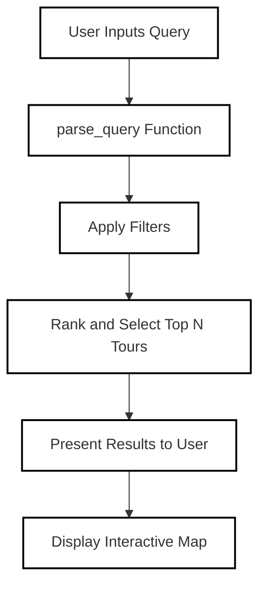

# Cycling Tour Recommendation System 🚴

## Table of Contents
- [Introduction](#introduction)
- [Features](#features)
- [Installation](#installation)
- [Usage](#usage)
- [Example Queries](#example-queries)
- [Technologies Used](#technologies-used)
- [Project Structure](#project-structure)
- [Flow Diagram](#flow-diagram)
- [Author](#author)

## Introduction
Welcome to the **Cycling Tour Recommendation System**! This project is designed to help cycling enthusiasts find the most suitable cycling routes based on their preferences and requirements. Whether you're a beginner looking for easy trails, a family seeking safe routes, or an experienced rider craving challenging paths, this system has got you covered.

Leveraging Natural Language Processing (NLP), geospatial analysis, and data filtering techniques, the application interprets your natural language queries to provide personalized cycling route recommendations in the Tyrol region.

## Features 🚀
- **Natural Language Query Handling:** Input your preferences in plain English, and the system interprets your needs.
- **Customized Recommendations:** Filters routes based on location, difficulty level, route length, elevation gain, user type, and seasonal availability.
- **Interactive Map Visualization:** View recommended routes on an interactive map with start and end points clearly marked.
- **User Type Constraints:** Tailored recommendations for different user types such as families, beginners, and enthusiasts.
- **Proximity Search:** Find routes near a specified location within a defined radius.

## Installation 🔧

### Prerequisites
- [Python 3.7+](https://www.python.org/downloads/)
- [Jupyter Notebook](https://jupyter.org/install)

### Clone the Repository
```bash
git clone https://github.com/yourusername/cycling-tour-recommendation.git
cd cycling-tour-recommendation
```

### Install Dependencies
It's recommended to use a virtual environment.

```bash
# Create a virtual environment
python -m venv venv

# Activate the virtual environment
# On Windows:
venv\Scripts\activate
# On macOS/Linux:
source venv/bin/activate

# Upgrade pip
pip install --upgrade pip

# Install required packages
pip install -r requirements.txt
```

If you don't have a `requirements.txt` file, install packages manually:

```bash
pip install pandas geopy folium spacy transformers torch nltk scikit-learn
```

### Download SpaCy Model
```bash
python -m spacy download en_core_web_sm
```

## Usage 🚴‍♂️
1. **Launch Jupyter Notebook:**

   ```bash
   jupyter notebook
   ```

2. **Open the Notebook:** Navigate to the `Cycling_Tour_Recommendation.ipynb` file and open it.

3. **Load the Data:** Ensure the GeoJSON data file (`cycling_tours.geojson`) is in the same directory as the notebook. Run the data loading cell.

4. **Enter Your Query:** Locate the cell designated for inputting queries. Enter your natural language query related to cycling routes.

5. **Run the Query:** Execute the cell to process your query. The system will display matching cycling tours based on your input.

6. **View on Map:** After running the query, an interactive map will be generated, visualizing the recommended routes.

## Example Queries 🔍
Here are some sample queries you can try:

- **Basic Query:**
  ```
  List me all the cycling routes.
  ```

- **Seasonal Availability:**
  ```
  List me the cycling routes for summer.
  ```

- **Location-Based Query:**
  ```
  Find cycling tours near Kufstein with a route length more than 10km and elevation gain less than 500 meters.
  ```

- **User Type Specific:**
  ```
  Find cycling routes near Landeck suitable for families.
  ```

- **Combined Criteria:**
  ```
  Find cycling routes near Schwaz with route length over 30km and elevation gain over 800 meters.
  ```

- **Difficulty and Season:**
  ```
  Find cycling routes that are loop tours available in September.
  ```
## Sample Map View 🗺️


## Technologies Used 🛠️
- **Python Libraries:**
  - `pandas` - Data manipulation and analysis.
  - `geopy` - Geocoding and distance calculations.
  - `folium` - Interactive map visualization.
  - `spaCy` - Natural Language Processing.
  - `transformers` - BERT-based models for NER and classification.
  - `nltk` - Natural Language Toolkit for text processing.

- **Machine Learning Models:**
  - **BERT-Based NER:** For extracting entities like locations from user queries.
  - **Zero-Shot Classification (BART):** For determining difficulty levels based on user descriptions.

## Project Structure 📁

```plaintext
cycling-tour-recommendation/
│
├── Cycling_Tour_Recommendation.ipynb
├── cycling_tours.geojson
├── requirements.txt
├── README.md
└── LICENSE
```

- `Cycling_Tour_Recommendation.ipynb`: Main Jupyter Notebook containing the implementation.
- `cycling_tours.geojson`: GeoJSON file with cycling tour data.
- `requirements.txt`: List of Python dependencies.
- `README.md`: Project documentation.
- `LICENSE`: License information.

## Flow Diagram 📊
### Query Processing Workflow


## Author 👤
- **Vikrant Singh**

## License 📜
This project is licensed under the MIT License - see the LICENSE file for details.
